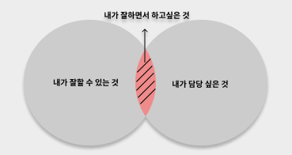

2주차 프로젝트를 준비하며, 변하지 않은 것 바로 **"대용량 트래픽"**

### 1주차 논의결과 간단요약

- 아키텍처: MSA
- 배포 구조: Kubernetes 기반 컨테이너 배포 (👀미정이였던 것 같은데)
- 메시징 시스템: Apache Kafka
- 인프라: AWS (EKS, RDS 등)
- 기술 스택: Spring Boot, Spring Cloud, React, MySQL, Redis  
  ㄴ\*FE스택과 SQL, 배포구조, Redis는 아직 정리되지 않은 추상적인 부분

오늘 다뤄 볼 내용은

1. 어떤 서비스에 어떤 기술 스택을 사용하고, 왜 사용하는가?
2. 난 뭘 잘할 수 있지?

---

## 1. 어떤 서비스에 어떤 기술 스택을 사용하고, 왜 사용하는가?

### 1-1. 프로젝트 내 서비스 기술 스택

  <h3 style="margin:5px 0 12px 0;">1. 주문</h3>
  
<strong>기술 스택:</strong> Spring Boot + JPA + Kafka Producer

  
<strong>선택 이유:</strong> 주문 생성 후 이벤트 발행으로 확장성과 비동기 처리 확보

  
<strong>비교군:</strong> Node.js + Express + REST API

  

    <strong>비교군 장점:</strong> 개발 속도 빠름, JS 기반 프론트엔드와 자연스러운 연결 
    <strong>비교군 단점:</strong> 동시접속 많으면 서버 병목 발생, 이벤트 스트리밍 기능 제한
  

  <h3 style="margin:5px 0 12px 0;">2. 결제</h3>
  
<strong>기술 스택:</strong> Spring Boot + Kafka Consumer + PG API 연동

  
<strong>선택 이유:</strong> 결제 요청 이벤트 기반 처리, 실패/재시도 유연

  
<strong>비교군:</strong> RabbitMQ + Python Flask

  

    <strong>비교군 장점:</strong> 메시지 라우팅 및 큐 관리 용이, 다양한 언어로 쉽게 연동 가능 
    <strong>비교군 단점:</strong> 대용량 스트리밍 처리 성능 제한, Java 생태계 연계 어려움
  

  <h3 style="margin:5px 0 12px 0;">3. 알림</h3>
  
<strong>기술 스택:</strong> Spring Boot + Kafka Consumer + 외부 알림 API

  
<strong>선택 이유:</strong> 실시간 이벤트 기반 알림 발송 가능

  
<strong>비교군:</strong> Node.js + Cron 배치

  

    <strong>비교군 장점:</strong> 구현 단순, 스케줄링 쉬움, 초기 개발 빠름 
    <strong>비교군 단점:</strong> 실시간 처리 불가, 이벤트 기반 확장 어려움
  

  <h3 style="margin:5px 0 12px 0;">4. 재고 관리</h3>
  
<strong>기술 스택:</strong> Redis + MySQL + Kafka Consumer

  
<strong>선택 이유:</strong> Redis 캐싱으로 빠른 재고 차감, MySQL로 최종 저장

  
<strong>비교군:</strong> PostgreSQL + DB 트랜잭션 기반

  

    <strong>비교군 장점:</strong> 트랜잭션 안정성 높음, SQL 기능 풍부 
    <strong>비교군 단점:</strong> 대규모 동시 요청 처리 시 락 병목 위험, 캐싱 필요
  

  <h3 style="margin:5px 0 12px 0;">5. 어드민 대시보드</h3>
  
<strong>기술 스택:</strong> React + Spring Cloud Gateway + Recharts

  
<strong>선택 이유:</strong> 주문/결제/재고 이벤트 실시간 시각화, 운영자 모니터링 가능

  
<strong>비교군:</strong> Vue.js + REST API

  

    <strong>비교군 장점:</strong> 경량 프레임워크, 빠른 초기 화면 개발 
    <strong>비교군 단점:</strong> 실시간 이벤트 연동 어려움, 확장성 제한
  

  <h3 style="margin:5px 0 12px 0;">6. 서비스 공통 인프라</h3>
  
<strong>기술 스택:</strong> Spring Cloud (Eureka, Config Server, Gateway)

  
<strong>선택 이유:</strong> MSA 환경에서 서비스 간 독립성과 확장성 확보

  
<strong>비교군:</strong> Monolith Spring Boot

  

    <strong>비교군 장점:</strong> 초기 개발 빠름, 단일 배포 관리 간단 
    <strong>비교군 단점:</strong> 서비스 규모 커지면 배포/확장 어려움
  

---

### 1-2. 추가될만한 서비스 기술 및 스택 요약

  <h3 style="margin:5px 0 12px 0;">1. 상품 추천/개인화</h3>
  
<strong>기술 스택:</strong> Kafka → Spring Boot → Redis 캐시 → React 시각화

  
<strong>이벤트 흐름:</strong> 이벤트 기반 추천, 캐싱 활용

  
<strong>비교군:</strong> Node.js + Redis → 단순 추천 로직

  

    <strong>비교군 장점:</strong> 개발 속도 빠름, JS 기반 FE와 자연스러운 연결 
    <strong>비교군 단점:</strong> 대규모 이벤트 스트리밍 처리 제한, 확장성 낮음
  

  
<strong>비고:</strong> ML 모델은 추후 확장 가능

  <h3 style="margin:5px 0 12px 0;">2. 리뷰/평점 관리</h3>
  
<strong>기술 스택:</strong> Spring Boot + MySQL/PostgreSQL + Kafka

  
<strong>이벤트 흐름:</strong> 예약 완료 후 리뷰 저장, 인기 순위 집계

  
<strong>비교군:</strong> Python Flask + RabbitMQ

  

    <strong>비교군 장점:</strong> 메시지 라우팅 용이, 다양한 언어 연동 쉬움 
    <strong>비교군 단점:</strong> 대용량 처리 성능 제한, Java 생태계와 연계 어려움
  

  
<strong>비고:</strong> 이벤트 기반 집계

  <h3 style="margin:5px 0 12px 0;">3. 실시간 알림/푸시</h3>
  
<strong>기술 스택:</strong> Kafka Consumer + WebSocket + Firebase Cloud Messaging (FCM)

  
<strong>이벤트 흐름:</strong> 결제/예약 이벤트 → 실시간 푸시 발송

  
<strong>비교군:</strong> Node.js + Cron 배치

  

    <strong>비교군 장점:</strong> 구현 단순, 초기 개발 빠름 
    <strong>비교군 단점:</strong> 실시간 처리 불가, 이벤트 기반 확장 어려움
  

  
<strong>비고:</strong> FE와 실시간 UI 연동

  <h3 style="margin:5px 0 12px 0;">4. 통계/분석 (Analytics)</h3>
  
<strong>기술 스택:</strong> Kafka → Spring Boot Consumer → Redis/H2 → React 대시보드

  
<strong>이벤트 흐름:</strong> 이벤트 기반 실시간 통계, DB 저장

  
<strong>비교군:</strong> ELK 스택 + Python

  

    <strong>비교군 장점:</strong> 로그 수집/분석 강력, 시각화 용이 
    <strong>비교군 단점:</strong> 초기 구축 복잡, Java 기반 서비스 연계 어려움
  

  
<strong>비고:</strong> ELK 없이 Java 중심으로 처리

  <h3 style="margin:5px 0 12px 0;">5. 프로모션/쿠폰</h3>
  
<strong>기술 스택:</strong> Spring Boot + Redis

  
<strong>이벤트 흐름:</strong> 핫딜, 쿠폰 발급/사용 상태 관리

  
<strong>비교군:</strong> PostgreSQL + DB 트랜잭션

  

    <strong>비교군 장점:</strong> 트랜잭션 안정성 높음 
    <strong>비교군 단점:</strong> 동시 요청 처리 시 락 병목 위험, 캐싱 필요
  

  
<strong>비고:</strong> Redis로 빠른 상태 조회

  <h3 style="margin:5px 0 12px 0;">6. 환불/취소</h3>
  
<strong>기술 스택:</strong> Kafka Consumer + Spring Boot + PG API

  
<strong>이벤트 흐름:</strong> 결제 취소 및 환불 처리, 재시도 로직

  
<strong>비교군:</strong> RabbitMQ + Python Flask

  

    <strong>비교군 장점:</strong> 메시지 라우팅 및 큐 관리 용이 
    <strong>비교군 단점:</strong> 대규모 처리 성능 제한, Java 연계 어려움
  

  
<strong>비고:</strong> 이벤트 기반 안정적 처리

  <h3 style="margin:5px 0 12px 0;">7. 글로벌 서비스</h3>
  
<strong>기술 스택:</strong> Spring Boot + React + i18n 라이브러리 + 외부 환율 API

  
<strong>이벤트 흐름:</strong> 다국어 번역, 다양한 통화 지원, 국가별 핫딜 제공

  
<strong>비교군:</strong> Node.js + 외부 i18n 라이브러리

  

    <strong>비교군 장점:</strong> 구현 단순, FE 친화적 
    <strong>비교군 단점:</strong> 대규모 글로벌 서비스 확장성 제한, Java 연계 어려움
  

  
<strong>비고:</strong> 글로벌 확장, 해외 유저 유입

---

## 2. 난 뭘 잘할 수 있지?

자 먼저, 사이드 프로젝트를 진행하다보면 프로젝트 조직에서의 역할이라는 것을 부여받게 된다.

여기서 선택과 집중이 필요하다...

선택과 집중에서 중요한 건 **"내가 잘할 수 있는 것"** 과 **"내가 담당하고 싶은 것"** 인데,

가장 좋은 건? 둘다 만족하는 "내가 잘하면서 하고 싶은 것"이다.

내 "주 무기"와 "니즈"를 합친다면...

내가 해당 프로젝트에서 할 수 있는 부분은 아래와 같을 것 으로 예상

1. 알림서비스, 어드민 대시보드
2. 결제, 주문 서비스
3. 재고 관리 서비스

여기서 자신있는 부분은 1번! 어드민 대시보드와 알림 서비스라고 생각.  
메인 코스인 결제는 내가 감당하기엔 너무 큰 서비스라고 생각하고, 알림 정도면 충분히 해낼지도.

전체 적인 흐름을 보아하면, 아래와 같이 예상.

### 세줄 요약

1. 서비스가 확장됨에 따라 생각보다 많은 기술 스택이 요구되고 볼륨이 커짐

ㄴ 보다 완벽하게(실제서비스 처럼) 만들 것인가? 에 대한 의문

2. 나는 알림서비스, 대시보드 하고싶어요!! 다만, 다른 부분 맡아도 확장성 있게 서비스 구현 가능해요

3. 전체적인 컨벤션 필요할 듯 해요... Git 관리부터, Code 영역 기타 등등...

---

#### 여기까지 읽어주셔서 감사합니다 :)
